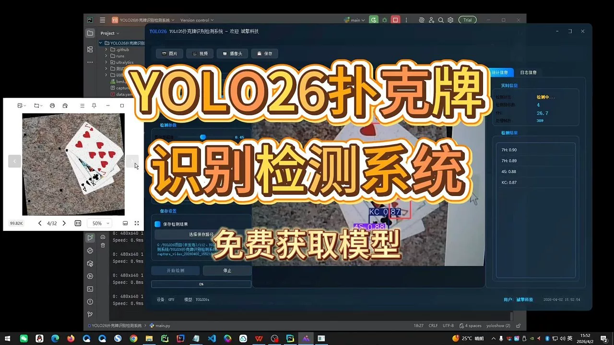

# YOLOv26 Poker Chip Recognition System | Dataset + Source Code

## Body

YOLO26 Poker Card Recognition System | Dataset + Source Code YOLO26 Poker Card Recognition Detection System (Project Source Code + Dataset + Model Weights + UI Interface + Python + Deep Learning + Remote Deployment)

Poker card recognition is a key task in computer vision applications such as intelligent entertainment, chess and checkers analysis, automated poker deck dispensing systems, etc. This paper builds an end-to-end recognition detection system for 52-class poker cards (including combinations of points and suits) based on the YOLO26 object detection algorithm. The experimental dataset used is self-built, consisting of 21,203 training images, 2,020 validation images, and 1,010 test images. The experimental results on the validation set show that the average precision mAP50 reaches 0.995, with precision and recall rates reaching 0.998 and 0.997 respectively, and all categories perform highly balanced, with no misclassification between any categories shown in the confusion matrix. The model's inference time on the NVIDIA RTX 4090 D GPU is only 1.8ms per image, meeting the real-time detection requirements. Overall, the proposed system achieves near-perfect detection performance in the poker card recognition task, demonstrating good engineering practical value.

Category definition: The dataset contains 52 categories, each represented by a combination of points and suits. Points include A, 2–10, J, Q, K, and suits include C (Club), D (Diamond), H (Heart), S (Spade). Example category labels are: 10C, 10D, 10H, 10S, 2C, 2D, 2H, 2S, ..., KC, KD, KH, KS, QC, QD, QH, QS. All categories strictly correspond to standard poker card faces.

Free remote installation appointment. Unsuccessful attempt will result in full refund.
Purchase includes the following resources (auto-unlocked in Baidu Cloud):
   - Complete source code for YOLO recognition detection project
   - YOLO format dataset
   - Training code + UI interface code
   - Trained model + result images
   - Software installation package
   - Add WeChat for remote installation appointment (shown automatically after purchase) - Unsuccessful attempt will result in full refund

⚙️ Core function modules
Detection capability
    Image detection: upload and detect immediately, returning detection boxes + category information
     Video detection: supports video files, analyzing frames accurately
     Camera real-time detection: connects to USB camera, achieving dynamic monitoring
Interaction and control
    Target selection: freely choose one or more categories for detection
    Parameter adjustment: adjustable confidence threshold & IoU threshold, flexibly controlling accuracy
    Result saving: save images/videos/camera detection results in one click
System and data
    User login registration: supports password strength checking + encryption storage
    Log recording: automatically records operation and error information (timestamped)

## Images

## Payment

Here is a pay link on Stripe ( https://buy.stripe.com/3cs8yP7sY87d0vu9AB ). Please contact me lonlonago@foxmail.com after funding $89, and I will send you a complete data files , thank you!

